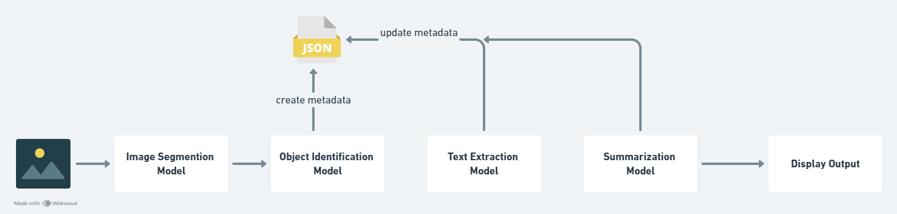

# Pipeline for Image Segmentation and Object Analysis

## Overview
This project implements a comprehensive pipeline that processes input images to segment, identify, and analyze objects within the image. The pipeline extracts text from the identified objects, summarizes their attributes, and outputs a detailed summary table. This pipeline leverages advanced deep learning models and OCR techniques to accomplish these tasks.

## Pipeline Architecture


### Installation
1. **Clone the repository**
    ```bash
    git clone https://github.com/Komalsai234/komal-sai-anurag-pasumarthy-wasserstoff-AiInternTask.git
    ```

2. **Create Conda Environment**
    ```bash
    conda create -p object_segmentation python==3.10 -y
    ```

3. **Activate the Environment and Install dependencies**
    ```bash
    pip install -r requirements.txt

4. **Run the Streamlit Application**
    ```bash
    streamlit run .\streamlit_app\app.py
    ```

## Usage Guidelines
1. Upload an Image
    - Upload an image through the Streamlit app interface.

2. Run Analysis
    - Click the "Analyze" button to process the image.

3. View Results
    - View the segmented image, object details, extracted text, and summarized attributes.

4. Download Output
    - Optionally, download the final output table and annotated image.

## Usage Guidelines
**Streamlit App URL:** https://komal-sai-anurag-wasserstoff-object-detection.streamlit.app/